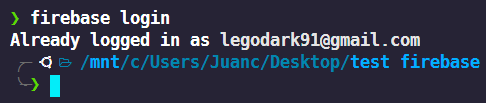
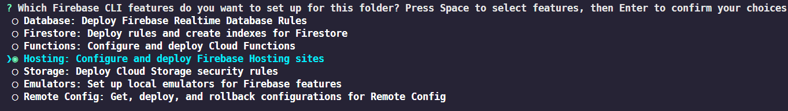
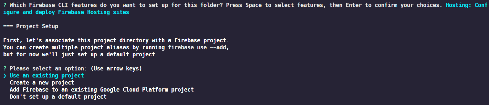
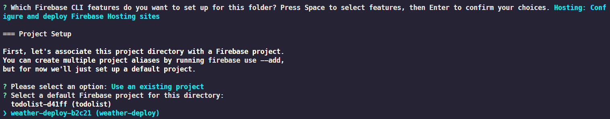
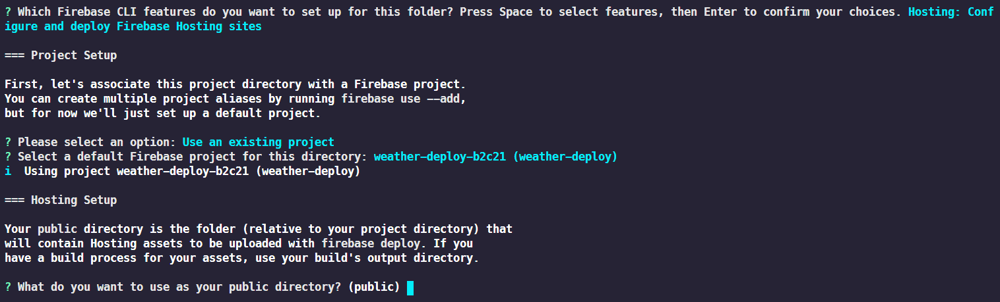
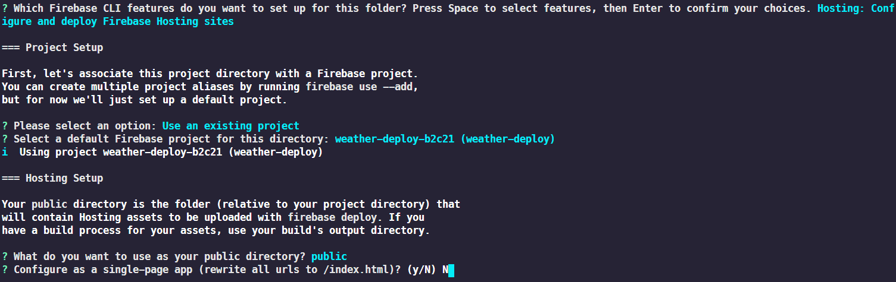
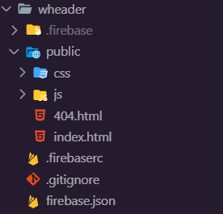

<h1 align="center">Deploy  Proyect on Firebase V.1.0.1</h1>

## Instrucciones

1. Crear un proyecto de Hoting en Firebase, en mi caso lo he llamado "wheather-deploy"

2. Creamos un repositorio en Github, para cuando realicemos cambios sobre el proyecto, estos queden reflejados, ademas de asegurarnos de que si tenemos algún fallo podemos volver hacía atras.

3. El siguiente paso seria descargarnos el repositorio, donde en este caso volcaremos el ejercicio de Wheather que hicimos en el modulo de Javascript Avanzado.

4. Vamos a preparar el proyecto para el deploy, ejecutando los siguientes comandos:

  -  `firebase login` - Con este comando nos logueamos dentro de nuestra cuenta de google)

  -  `firebase init` - Con este comando realinicializaremos la configuración del proyecto en la carpeta que tengamos nuestros archivos que queremos desplegar.

  

  

  

  

  

  -  `firebase serve --only hosting` - Con este comando lo que hacemos es levantar el proyecto en local, lo usaremos para ver como esta el proyecto antes de hacer un deploy y que lo pueda ver todo el mundo.

5. Por ultimo, una vez tengamos el proyecto con los archivos que deseamos subir, realizamos el desploy de la aplicación usando el siguiente comando:

- `firebase deploy` - Con este comando iniciamos el proyecto en el directorio en el que estamos, se nos hara una serie de preguntas, una de las cuales es el servicio que queremos utilizar, en este caso en la selección de servicios marcaremos nada mas que Hosting

6. Nuestra carpeta de proyecto debería de quedar en algo parecido a esto:

Aquí puedes ver como queda, en mi caso, el proyecto desplegado:

<a href="https://weather-deploy-b2c21.web.app/">Wheather App</a>

